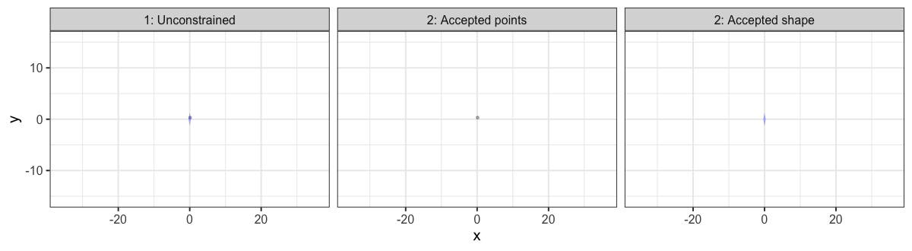
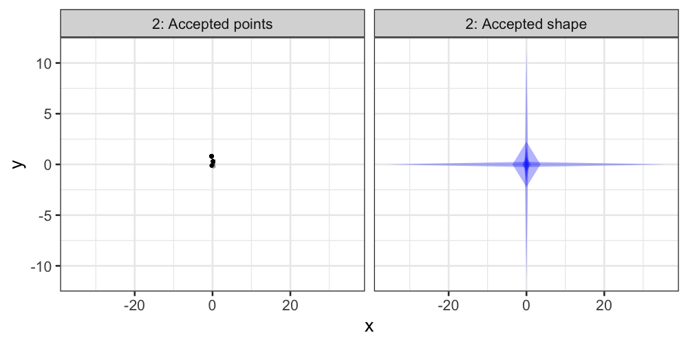
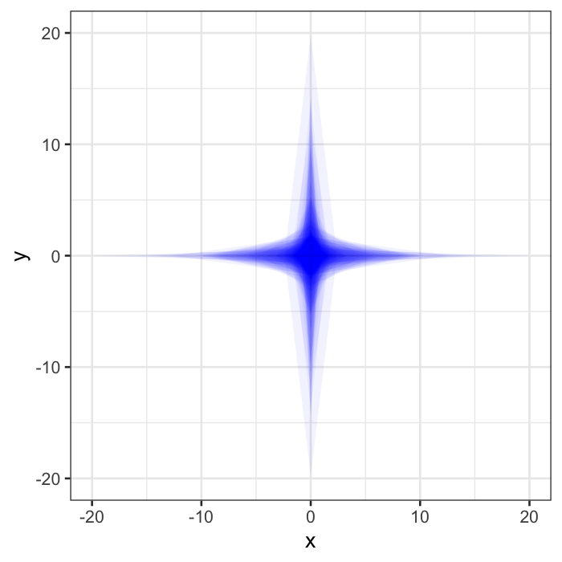

```{r setup, load_refs, include=FALSE, cache=FALSE}
library(RefManageR)
BibOptions(check.entries = FALSE,
           bib.style = "authoryear",
           cite.style = "authoryear",
           style = "html",
           hyperlink = FALSE,
           dashed = FALSE)
myBib <- ReadBib("bib-sc-sampler.bib", check = FALSE)

library(ggplot2)
source("one-dim-sc-example-viz.R")

```

## Talk outline
<br>
1. **Bayesian Lasso**: An interesting reinterpretation (at least to me). 
<br><br><br>
2. **Stochastic constraints variables**: A good name?
<br><br><br>
3. **Stochastic nets**: Continuous shrinkage priors as stochastic constraints.
<br><br><br>
4. **Geometry**: I'll show some pictures and wave my hands.
<br><br><br>
5. **A new Gibbs sampler**: A bit speedy, more stable. *Or the MC part*.

---

## The Lasso 

```{r aqua-lasso-1, echo=FALSE, eval=TRUE}
knitr::include_graphics("imgs/aquaman-hammerhead-1967-cartoon.JPG")
```

<!--- If aquaman can use a lasso under water, what can I do? "Weird" ---> 

---

## The standard Lasso

### Lagrangian form

$$\max_{\boldsymbol{\theta} \in \mathbb{R}^{p}} \log \pi(\boldsymbol{x}|\boldsymbol{\theta}) + \lambda \Vert \boldsymbol{\theta} \Vert_{1}$$

### Constrained form

$$			\max_{\tilde{\boldsymbol{\theta}} \in \mathbb{R}^{p}} \log \pi(\boldsymbol{x}|\tilde{\boldsymbol{\theta}}) \quad\text{ s.t. } \quad \Vert \tilde{\boldsymbol{\theta}} \Vert_{1} \leq \tilde{\omega}$$

```{r tib-ref, echo=FALSE, eval=FALSE, results='asis'}
cat("<br><br><br> see ",Citet("Tibshirani1996", bib = myBib))
```

---

## The Bayesian Lasso

### Standard probabilistic model:

$$(\boldsymbol{x}|\boldsymbol{\theta}) \sim \pi(\boldsymbol{x}|\boldsymbol{\theta})$$
$$\boldsymbol{\theta} \overset{\text{iid}}{\sim} \text{Exp}(\lambda)$$

### Constrained probabilistic model:

$$(\boldsymbol{x} \vert \boldsymbol{\theta}) \sim \pi(\boldsymbol{x} \vert \boldsymbol{\theta}) $$

$$(\boldsymbol{\theta},\omega) \overset{\text{d}}{=} (\tilde{\boldsymbol{\theta}},\tilde{\omega}\;\; \text{s.t.}\;\; \Vert \tilde{\boldsymbol{\theta}} \Vert_{1} \leq \tilde{\omega}) $$

$$\tilde{\boldsymbol{\theta}} \sim f_{\tilde{\boldsymbol{\theta}}} \propto 1 \qquad \tilde{\omega} \sim \text{Exp}(\lambda)$$
<!--- More complicated, but exposes inner facets, Marginalising over $\omega$ results in the original Bayesian Lasso. --->

---

## The constrained Bayesian Lasso

This looks suspiciously like changing the constrained Lasso
<br><br>
$$\max_{\tilde{\boldsymbol{\theta}} \in \mathbb{R}^{p}} \log \pi(\boldsymbol{x} \vert \tilde{\boldsymbol{\theta}}) \quad\text{ s.t. } \quad \Vert \tilde{\boldsymbol{\theta}} \Vert_{1} \leq \tilde{\omega}$$
<br>
to a Bayesian problem by setting priors
<br><br>
$$\tilde{\boldsymbol{\theta}} \sim f_{\tilde{\boldsymbol{\theta}}} \propto 1 \qquad
\tilde{\omega} \sim \text{Exp}(\lambda)$$
<br>
just as we had with stochastic constraints.
<!--- 
	\item Closer connection between Bayesian and standard Lasso
	\item Connected by more than just the MAP
\end{itemize} --->


---

## Duality and analogy to regularisation
<br><br><br>

| *Inference*  | *Regularisation*                                          |
|--------------|-----------------------------------------------------------|
| Optimisation | Penalty $\Longleftrightarrow$ constraint                  |
| Bayesian     | Prior   $\Longleftrightarrow$ stochastic constraint prior |

--

<br><br>
The duality between stochastic constraint priors and their standard representation is analagous to the duality between penalty and constraint regularisation in optimisation.

---

## Stochastic constraint framework

### Components 

|||
|-------------------------|--------------|
| Base prior             | $\tilde{\boldsymbol{\theta}} \sim f_{\tilde{\boldsymbol{\theta}}}, \quad \tilde{\boldsymbol{\theta}} \in \Theta \subseteq \mathbb{R}^{p}$ |
| Constraint variable      | $\tilde{\boldsymbol{\omega}} \sim f_{\tilde{\boldsymbol{\omega}}}, \quad \tilde{\boldsymbol{\omega}} \in \Omega \subseteq \mathbb{R}^{q}$ |
| Penalty function  | $\boldsymbol{r}(\boldsymbol{\theta}): \qquad \Theta \rightarrow \Omega$ |

--

**Key idea**: Truncation is applied *jointly* to base and constraint variables.

--

**Connections**

- Scale mixture of normals
- Scale mixture of uniforms
- Slice sampling
- Skew random variables
- Exponentially tilted random variables
- Latent variable approaches

<!---#### Base prior: 

$\tilde{\boldsymbol{\theta}} \sim f_{\tilde{\boldsymbol{\theta}}}, \quad \tilde{\boldsymbol{\theta}} \in \Theta \subseteq \mathbb{R}^{p}$.
    
#### Constraint variable: 

$\tilde{\boldsymbol{\omega}} \sim f_{\tilde{\boldsymbol{\omega}}}, \quad \tilde{\boldsymbol{\omega}} \in \Omega \subseteq \mathbb{R}^{q}$
    
#### Penalty function: 

$\boldsymbol{r}(\boldsymbol{\theta}): \Theta \rightarrow \Omega$ -->

---

## Stochastic constraint framework

### Structure

$$(\boldsymbol{\theta}, \boldsymbol{\omega} \vert \boldsymbol{\lambda}) \overset{\text{d}}{=} (\tilde{\boldsymbol{\theta}}, \tilde{\boldsymbol{\omega}} \;\vert\;  \boldsymbol{r}(\tilde{\boldsymbol{\theta}}) \preceq \tilde{\boldsymbol{\omega}}, \boldsymbol{\lambda})$$

$$\tilde{\boldsymbol{\theta}} \sim f_{\tilde{\boldsymbol{\theta}}}$$ 
$$(\tilde{\boldsymbol{\omega}} \vert \boldsymbol{\lambda}) \sim f_{\tilde{\boldsymbol{\omega}}  \vert \boldsymbol{\lambda}}$$

The joint support of the joint distribution $(\tilde{\boldsymbol{\theta}}, \tilde{\boldsymbol{\omega}})$ is constrained element-wise by the inequality $\boldsymbol{r}(\tilde{\boldsymbol{\theta}} ) \preceq \tilde{\boldsymbol{\omega}}$.


---

## Examples

```{r aqua-lasso-2, echo=FALSE, eval=TRUE,  out.width = 732, out.height = 488}

```

---

## 1D example

| Base prior | Penalty | Constraint |
|------------|---------|------------|
| $\text{N}(0,1)$ | $-$ | $-$ |

```{r sc-example-1, echo=FALSE, eval=TRUE, out.width = 600, out.height = 400, fig.align='center'}
print(plot_normal)
```

---

## 1D example

| Base prior | Penalty | Constraint |
|------------|---------|------------|
| $\text{N}(0,1)$ | $\vert\theta\vert$ | $\text{Exp}(1)$ |

```{r sc-example-2, echo=FALSE, eval=TRUE, out.width = 600, out.height = 400, fig.align='center'}
print(plot_normal_l1_exp)
```

---

## 1D example

| Base prior | Penalty | Constraint |
|------------|---------|------------|
| $\text{N}(0,1)$ | $\vert\theta\vert$ | $\text{Gamma}(0.5,1)$ |

```{r sc-example-3, echo=FALSE, eval=TRUE, out.width = 600, out.height = 400, fig.align='center'}
print(plot_normal_l1_gamma)
```

---

## Horseshoe prior

$$(\boldsymbol{\theta}, \boldsymbol{\omega} \;\vert\; \boldsymbol{\lambda}) \overset{\text{d}}{=} \left( \tilde{\boldsymbol{\theta}}, \tilde{\boldsymbol{\omega}} \;\vert\; \tilde{\theta}_{i}^{2} \leq \tilde{\omega}_{i} \;\forall i \in P, \boldsymbol{\lambda} \right)$$
$$\tilde{\boldsymbol{\theta}} \sim f_{\tilde{\boldsymbol{\theta}}} \propto 1$$
$$(\tilde{\omega}_{i}\vert\lambda_{i},\tau) \sim \text{Exp}(2^{-1} [\lambda_{i}\tau]^{-2})$$
$$\lambda_{i} \sim \text{Cauchy}_{+}(0,1)$$
$$\tau  \sim \text{Cauchy}_{+}(0,1)$$
$$\text{for } i \in P = \{1,2,3,\ldots,p\}$$
--

Similar representations exist for
- Scale-normal mixtures
- Regularised-horseshoe
- Dirichlet-Laplace
- R2-D2 prior

<!--- Add box around SC part to demo marginalisation?--->

---

## Stochastic nets

I refer to the family of stochastic constraint priors that contain continuous shrinkage priors (horseshoe etc.) as *stochastic nets*.

**... why?**

--

```{r aqua-flying-fish, echo=FALSE, eval=TRUE, fig.align='center'}

```

---

## Visualisation of generative process

$$(x,y) \sim \text{N}(0,1)$$
$$\boldsymbol{\lambda} \sim \text{Dir}(1,1)$$

$$\tau \sim \text{Exp}(2)$$

$$\text{s.t. } \lambda_{1}\vert x \vert + \lambda_{2}\vert y \vert \leq \tau$$

```{r sc-reject-gif, echo=FALSE, eval=TRUE, fig.align='center'}

```

---

## Visualisation of generative process

$$(x,y) \sim \text{N}(0,1)$$
$$\boldsymbol{\lambda} \sim \text{Dir}(1,1)$$

$$\tau \sim \text{Exp}(2)$$

$$\text{s.t. } \lambda_{1}\vert x \vert + \lambda_{2}\vert y \vert \leq \tau$$

```{r sc-reject-pause, echo=FALSE, eval=TRUE, fig.align='center'}

```

---

## A stochastic net: constraining variables

```{r sc-reject-shape, echo=FALSE, eval=TRUE, fig.align='center', out.height=500, out.width=600}

```

---

## Gibbs samplers for continuous-shrinkage priors

### Ingredients of standard algorithm

--

(a) Sample $(\boldsymbol{\beta}~\vert~ \boldsymbol{\lambda}, \sigma^2, \tau) \sim \text{N}(\boldsymbol{\mu},\boldsymbol{V})$.
   - $\boldsymbol{\mu} = \boldsymbol{V}\boldsymbol{X}^{\top}\boldsymbol{y}$
   - $\boldsymbol{V} = (\boldsymbol{X}^{\top}\boldsymbol{X} + \boldsymbol{S}^{-1})^{-1}$
   - $\boldsymbol{S}$ = diagonal matrix from $\boldsymbol{\lambda}$ and $\tau$.

--

(b) Sample $(\sigma^2~\vert~\boldsymbol{\beta}, \boldsymbol{\lambda}, \tau) \sim \text{IG}(a_{1},a_{2})$

--

(c) Sample $(\boldsymbol{\lambda}~\vert~\boldsymbol{\beta}, \sigma^2, \tau)$

--

(d) Sample $(\tau~\vert~ \boldsymbol{\beta}, \boldsymbol{\lambda}, \sigma^2)$

--

**Q:** What is the computational bottleneck of this algorithm?

--

**A:** Inverting (or decomposing) $\boldsymbol{V}$ is $\mathcal{O}(p^3)$.

---

## Gibbs samplers for continuous-shrinkage priors

### Truncated-Gibbs sampler

**Aim**: Exploit the geometry by decomposing the prior to create a better Gibbs sampler.

--

(a1) Sample $(\boldsymbol{\omega}~\vert~\boldsymbol{\beta}, \boldsymbol{\lambda}, \sigma^2, \tau) \sim \text{sExp}(b_1)$

--

   - Use $\boldsymbol{\omega}$ (current magnitude) to choose appropriate sampling step, namely

--
   
   - Order $\boldsymbol{\omega}$ by size and split into two groups, $I$ and $J$. Where $\omega_{i} \leq \epsilon$ for $i \in I$.


--

(a2) Sample $(\beta_{i}~\vert~ \boldsymbol{\beta}_{(i)},\boldsymbol{\omega}, \boldsymbol{\lambda}, \sigma^2, \tau) \sim \text{U}(-\omega_{i}^{1/\nu},\omega_{i}^{1/\nu})$ with MH correction.

--

   - The dependence on $\boldsymbol{\beta}_{(i)}$ exists but is very small. You can argue that $(\beta_{i}~\vert~ \boldsymbol{\beta}_{(i)},\boldsymbol{\omega}, \boldsymbol{\lambda}, \sigma^2, \tau) \overset{d}{\approx} (\beta_{i}~\vert~\boldsymbol{\omega}, \boldsymbol{\lambda}, \sigma^2, \tau)$ if $\epsilon$ is small enough.

--

(a3) Sample $(\boldsymbol{\beta}_{J}~\vert~ \boldsymbol{\beta}_{I}, \boldsymbol{\lambda}, \sigma^2, \tau) \sim \text{N}(\boldsymbol{\mu}_{J|I},\boldsymbol{V}_{J|I})$.

   - Note: $\boldsymbol{\omega}$ marginalised out. Not neccesary, but practical.


**Complexity**: $\mathcal{O}(\vert J \vert^{3} + p \vert I\vert)$.

--

We can fix $\vert J \vert^{3}$ by selection $\epsilon$ adaptively then it is $\mathcal{O}(p^2)$.

--

---

This only works because in the high dimesional setting with shrinkage priors the majority of coefficients are forced to be very close to zero.
<br><br>
```{r more-aqua, echo=FALSE, eval=TRUE, fig.align='center'}

```
--
Understanding the structure and geometry of the problem is important!

---

## Results on some toy problems

### Model:

---

## Results on some toy problems

### Error:

---

## Results on some toy problems

### Time:

---

## Conclusions

- Other areas under investigation:

   - Theorectical results

   - Prior construction
   
   - Variable selection from continuous-shrinkage prior

---

## References
